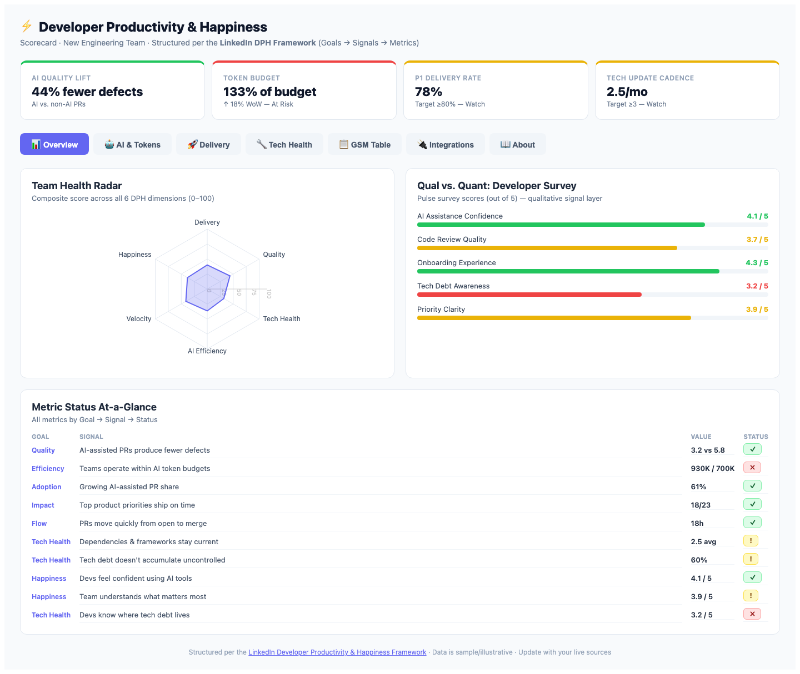
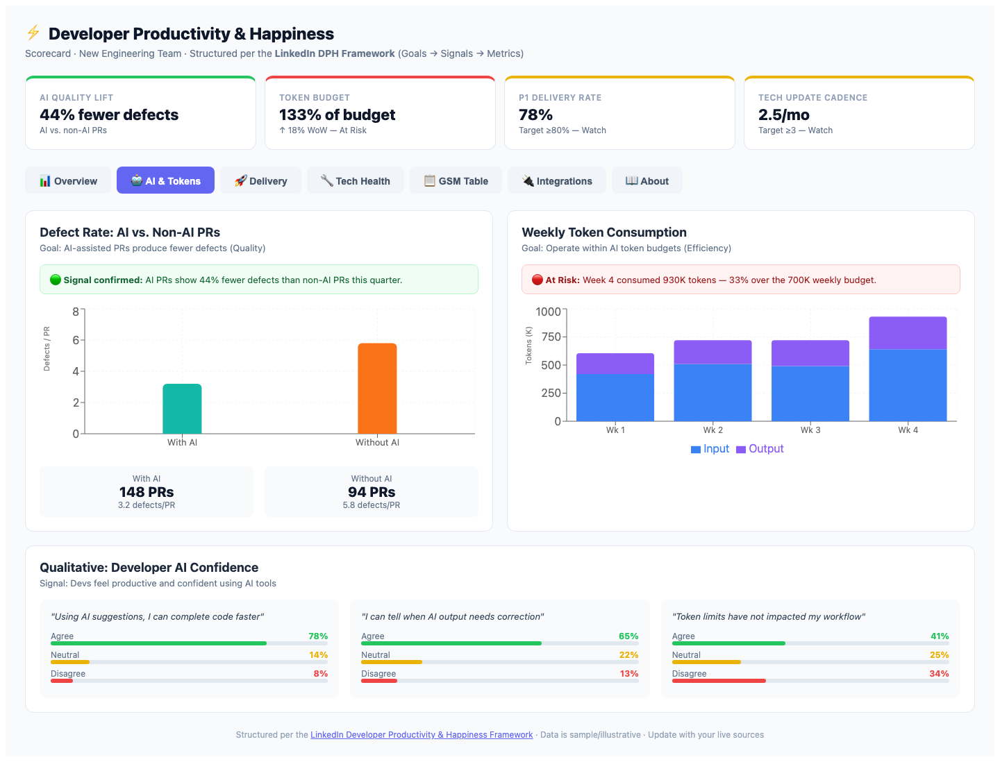
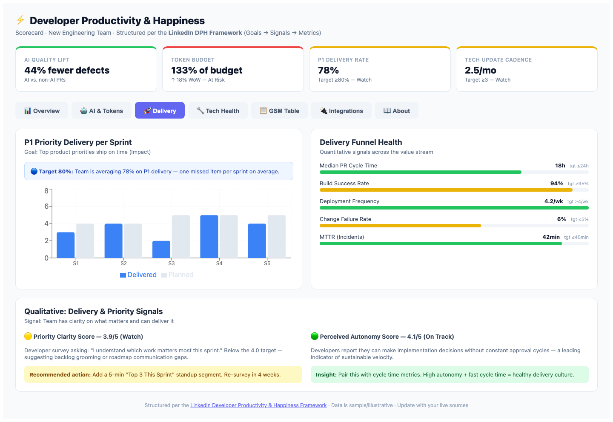
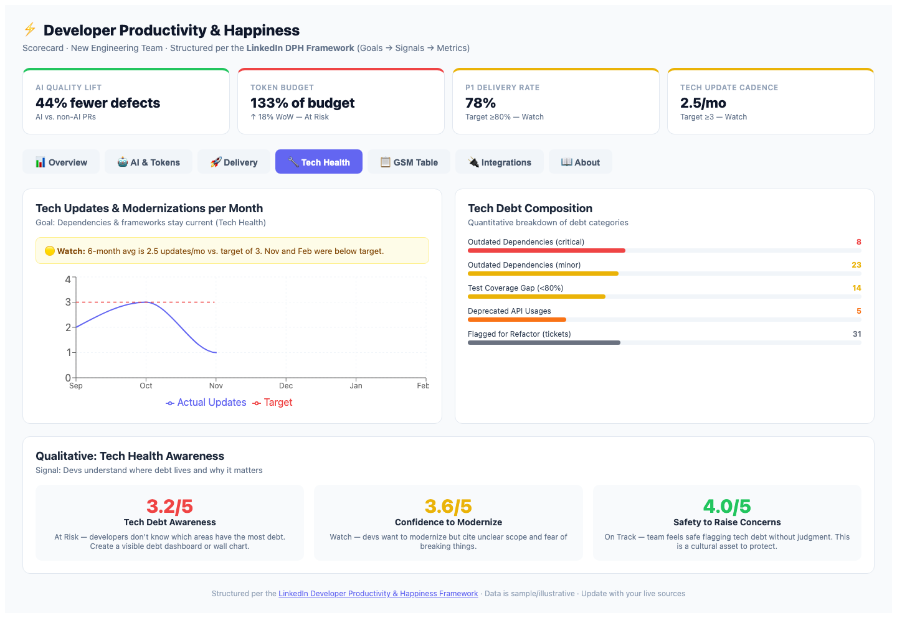
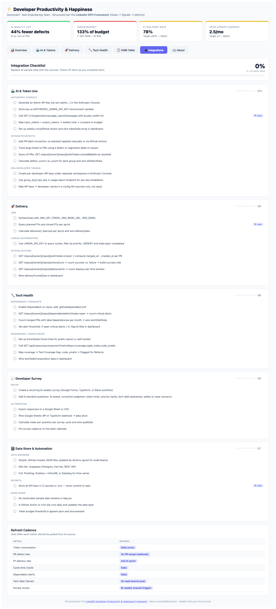
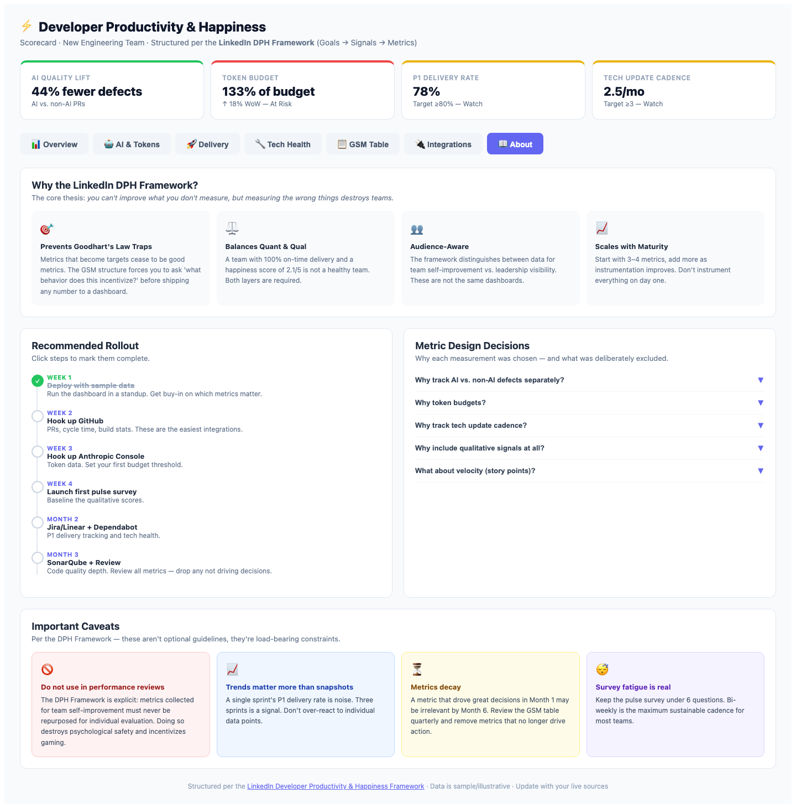

# team-metrics
Developer Productivity & Happiness Scorecard — LinkedIn DPH Framework

## Quick Start
1. Copy `.env.example` to `.env` and fill in your API keys
2. Run `npm install` then `npm run dev`
3. See [integration-checklist.md](./integration-checklist.md) to replace sample data with live sources

## Stack
- React 18 + Vite
- Recharts for visualizations
- Anthropic Console API (tokens)
- GitHub REST API (PRs, cycle time, builds)
- Jira / Linear API (P1 delivery)

## Docs
- [Project Writeup](./project-writeup.md)
- [Integration Checklist](./integration-checklist.md)
- [LinkedIn DPH Framework](https://linkedin.github.io/dph-framework/)

---

## Dashboard Views

The dashboard has 7 tabs. Screenshots below are placeholders — replace with actual captures after running `npm run dev`.

---

### 1. Overview

The landing view gives a full-team pulse at a glance.

**Top bar — 4 KPI banners** (always visible across all tabs):
| Banner | Current | Status |
|---|---|---|
| AI Quality Lift | 44% fewer defects | On Track |
| Token Budget | 133% of budget | At Risk |
| P1 Delivery Rate | 78% | Watch |
| Tech Update Cadence | 2.5/mo | Watch |

**Team Health Radar** — a 6-axis spider chart scoring Delivery, Quality, Tech Health, AI Efficiency, Velocity, and Happiness on a 0–100 scale. Gives leadership and the team an instant composite view. Any axis below ~65 is a conversation starter.

**Developer Survey Bar Chart** — horizontal progress bars for 5 qualitative dimensions (AI Assistance Confidence, Code Review Quality, Onboarding Experience, Tech Debt Awareness, Priority Clarity), each scored 1–5. Color-coded green/yellow/red against the 4.0 target.

**Metric Status At-a-Glance** — a compact table mapping every metric to its Goal, Signal, current value, and a green/yellow/red status badge. This is the DPH GSM structure — you can trace every number back to a human behavior it's meant to signal.

---

### 2. AI & Tokens

Answers the central question for AI-native teams: *Is our AI investment paying off, and are we spending wisely?*

**Defect Rate: AI vs. Non-AI PRs** — a bar chart comparing defects-per-PR for AI-assisted PRs (3.2) vs. non-AI PRs (5.8). A contextual banner confirms the signal: AI PRs show 44% fewer defects this quarter. Includes a stat summary showing total PR counts per group.

**Weekly Token Consumption** — a stacked bar chart (input tokens + output tokens per week) with a dashed red budget line at 700K tokens/week. Week 4 visually breaks through the budget line at 930K — the at-risk alert fires automatically. This makes overspend visible before it becomes a rate-limit crisis mid-sprint.

**Developer AI Confidence Survey** — three survey questions broken into Agree/Neutral/Disagree percentage bars:
- *"Using AI suggestions, I can complete code faster"* — 78% agree
- *"I can tell when AI output needs correction"* — 65% agree
- *"Token limits have not impacted my workflow"* — only 41% agree (flagged: budget pressure is affecting flow)

---

### 3. Delivery

DORA-inspired delivery health across the full value stream.

**P1 Priority Delivery per Sprint** — a grouped bar chart showing Delivered vs. Planned P1 items per sprint (S1–S5). Team is averaging 78% against an 80% target — roughly one missed priority per sprint. The chart makes it obvious which sprints had scope creep (S3: 2 of 5 delivered).

**Delivery Funnel Health** — five DORA-aligned metrics displayed as labeled progress bars with target annotations:
| Metric | Value | Target |
|---|---|---|
| Median PR Cycle Time | 18h | ≤24h |
| Build Success Rate | 94% | ≥95% |
| Deployment Frequency | 4.2/wk | ≥4/wk |
| Change Failure Rate | 6% | ≤5% |
| MTTR (Incidents) | 42min | ≤45min |

**Qualitative Delivery Signals** — two side-by-side insight cards:
- *Priority Clarity* (3.9/5, Watch) — includes a recommended action: add a "Top 3 This Sprint" standup segment and re-survey in 4 weeks.
- *Perceived Autonomy* (4.1/5, On Track) — contextual note that high autonomy paired with fast cycle time is a leading indicator of sustainable velocity.

---

### 4. Tech Health

Surfaces leading indicators of future incident risk and onboarding friction.

**Tech Updates & Modernizations per Month** — a line chart tracking actual dependency/framework updates (Sep–Feb) against a target of 3/month. The 6-month average sits at 2.5. November and February both dipped below target — visible as points below the dashed red line.

**Tech Debt Composition** — five debt categories displayed as color-coded progress bars:
| Category | Count | Color |
|---|---|---|
| Outdated Dependencies (critical) | 8 | Red |
| Outdated Dependencies (minor) | 23 | Yellow |
| Test Coverage Gap (<80%) | 14 | Yellow |
| Deprecated API Usages | 5 | Orange |
| Flagged for Refactor (tickets) | 31 | Gray |

**Tech Health Awareness Survey** — three score cards:
- *Tech Debt Awareness* — 3.2/5 (At Risk): developers don't know where the debt lives. Recommended action: create a visible debt wall chart.
- *Confidence to Modernize* — 3.6/5 (Watch): devs want to modernize but cite unclear scope.
- *Safety to Raise Concerns* — 4.0/5 (On Track): cultural asset to protect.

---

### 5. GSM Table

The canonical source of truth for what the team is measuring and why.

**Full GSM Reference Table** — all 10 metrics in a sortable table with columns: Goal, Signal, Metric, Value, Trend (▲/▼%), Type (Qual/Quant), and Status badge. Filterable two ways:
- **By section:** All / AI & Token Use / Delivery / Tech Health
- **By type:** Quantitative / Qualitative / All

This view is designed for quarterly reviews — "does this metric still drive decisions?"

**Framework Notes: Qual vs. Quant Balance** — a two-column explainer card comparing the purpose, risks, and examples of each measurement type. Useful for onboarding new team members to the DPH philosophy and why both layers are required.

---

### 6. Integrations

An interactive checklist for replacing all sample data with live API sources.

**Overall Progress Bar** — a large percentage readout (e.g., `0%` → `100%` as items are checked) with a progress bar and `X / 39 items done` counter. The tab label in the nav updates live to show completion: `🔌 Integrations (12%)`.

**Five collapsible sections**, each with its own section-level progress bar:
- 🤖 AI & Token Use (12 items) — Anthropic Console API key setup, token budget wiring, GitHub PR label convention for AI detection, per-developer token tracking
- 🚀 Delivery (8 items) — Jira/Linear P1 query setup, GitHub Actions cycle time and build metrics
- 🔧 Tech Health (8 items) — Dependabot alerts, SonarQube/CodeClimate code quality metrics
- 💬 Developer Survey (6 items) — Survey tool setup (Google Forms/Typeform), automated response ingestion
- 🗄️ Data Store & Automation (7 items) — Backend choice (JSON/Supabase/Grafana), secrets management

Checklist items with API calls or code have a **▼ code** toggle that expands an inline dark-background code block (e.g., the Anthropic Usage API curl command, Jira JQL query, or the full `.env` secrets list).

**Refresh Cadence Table** — a reference table showing how often each metric should be pulled from its source (daily cron, on-merge webhook, end-of-sprint, etc.).

---

### 7. About

The framework rationale and rollout guide — useful for team onboarding and stakeholder buy-in conversations.

**Why the LinkedIn DPH Framework?** — four cards explaining the core principles:
- Prevents Goodhart's Law traps (metrics that become targets)
- Balances quantitative outputs with qualitative developer experience
- Audience-aware (team self-improvement ≠ leadership dashboards)
- Scales with team maturity (start small, add as instrumentation improves)

**Recommended Rollout Timeline** — an interactive vertical timeline with 6 steps (Week 1 through Month 3). Click any step to toggle it complete — the dot fills green and the title gets a strikethrough. Useful for tracking actual onboarding progress.

**Metric Design Decisions** — a collapsible accordion with 5 entries explaining *why* each measurement was chosen (and what was deliberately excluded). Covers: AI vs. non-AI defect tracking, token budgets, tech update cadence, qualitative signals, and the deliberate exclusion of story point velocity.

**Important Caveats** — four color-coded cards with non-negotiable constraints from the DPH Framework:
- Do not use this data in performance reviews (red)
- Trends matter more than snapshots (blue)
- Metrics decay — review quarterly (yellow)
- Survey fatigue is real — keep it under 6 questions (purple)

---

> **Adding real screenshots:** Run `npm run dev`, navigate to each tab, and save captures to `docs/screenshots/` matching the filenames above. The README will render them automatically on GitHub.
